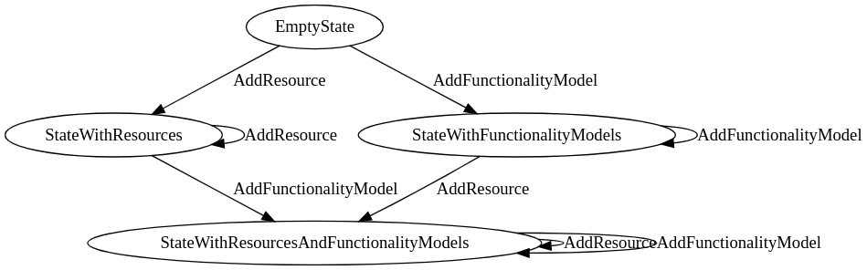

# Automated Configuration Enabler

## Test Scenarios

### Register and fail-over

1. System receives message with desired configuration:
    - Configuration message contains multilevel requirements. Proper serialization is used.
    - Configuration contains reference to resources by id and by label type
2. System notifies the observers that requirements are not met.
3. Resources register and gradually fill in requirements. On every resource change observer is notified
    - During the process at least two resources go down. No special action is taken
4. Finally, requirements are met. Observer is notified.
5. Resource A goes down
    - System is partially reconfigured to keep the highest weight functionality
6. After some resource goes down critical functionality goes down
    - System goes in maintenance mode.

#### Analogous scenario

Analogous scenario will be implemented - with first resources registering and then requirements being sent.

### Multi-step configuration

1. System receives configuration that defines custom actions to be executed after each resource is being registered

## Raw Decision documentation

### Circe

We decided to use Circe as serialization library. Circe will fail in compilation time if
any serialization (or deserialization) Codec is missing.
This is consistent with our type-safe approach which focus on preventing erros compile-time.

### `FunctionalityModel`

FunctionalityModel represents basic functionality that system needs to maintain

### SystemConfigBehavior

This is main Actor responsible for handling transition changes.
It is implemented using persistent FSM.

#### State Transition Model

[source](https://bit.ly/3kVQfmB)

## Authors

- [Piotr Lewandowski](piotr.lewandowski@ibspan.waw.pl)
- [Wiesław Pawłowski](wieslaw.pawlowski@ibspan.waw.pl)
- [Piotr Sowiński](piotr.sowinski@ibspan.waw.pl)
- [Przemysław Hołda](przemyslaw.holda@ibspan.waw.pl)

## License

Automated Configuration Enabler code is released under the Apache License 2.0. See the `LICENSE` file for details.
